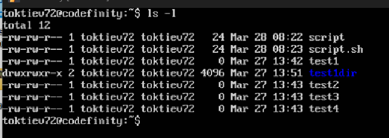
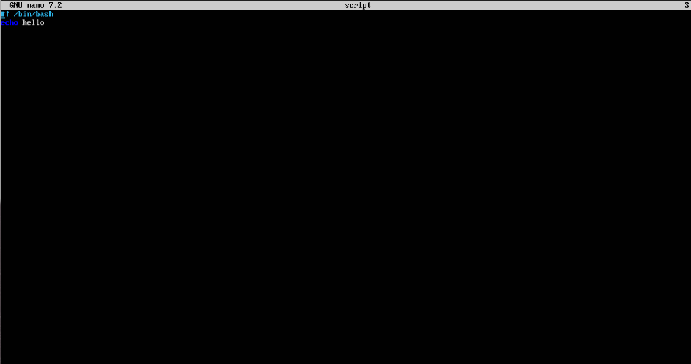
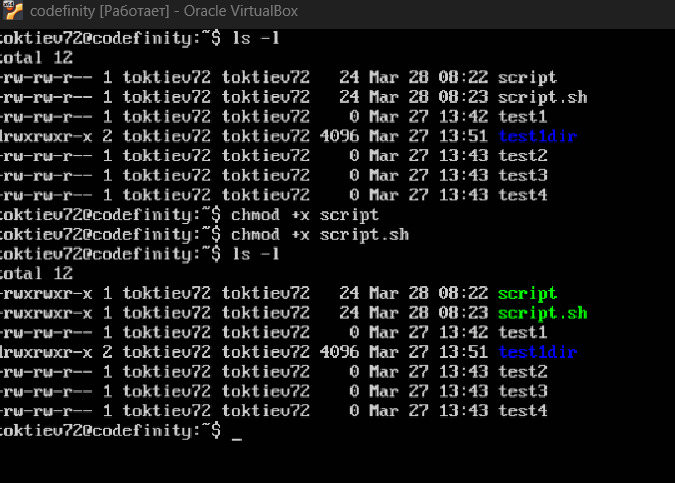
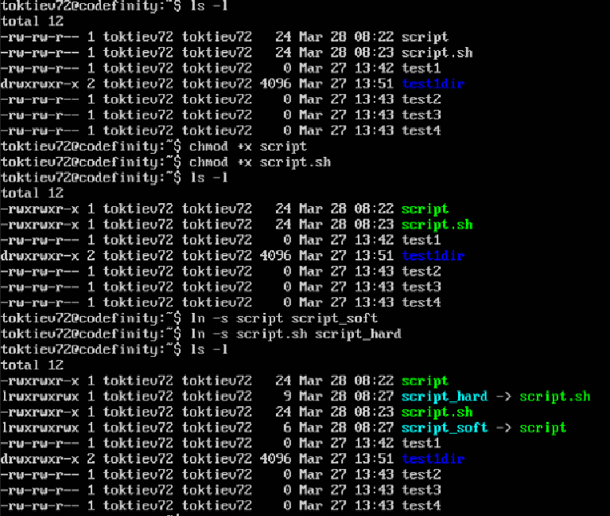
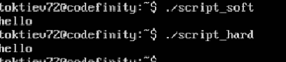
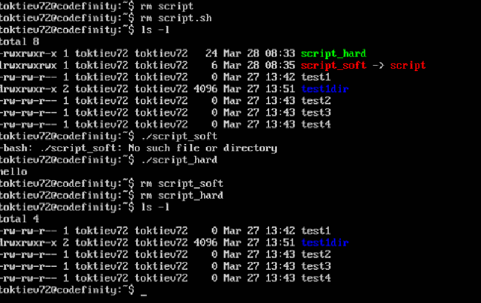

1. Созданные файлы script и script.sh

2. Содержание файлов script и script.sh 

3. Делаем файлы script и script.sh исполняемыми 

4. Создание символической и жесткой ссылки для файлов script и script.sh

5. Запуск символической и жесткой ссылки

6. Удаление исходных файлов, запуск ссылок и удаление всех файлов 
